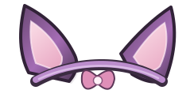

# Subby's Plushies + Wardrobe

**A plushie companion add-on for Bondage Club, featuring collectible plushies, expressive interactions, personal progress, room activities, and colorable accessories.**

> **community add-on.** Subby's Plushies is not part of the base game. The public v3.3.5 release contains the **Cat-Ear Headband** and **Heart Charm** accessories; the experimental robe and its pose variants are **not** included but the tests were conclusive.

## What is Subby's Plushies?

Subby's Plushies adds a playful, customizable plushie system to Bondage Club. Pick a favorite plushie, hold it or equip it in the add-on slot, interact with other characters, watch its mood develop, and explore little stories along the way. The extension panel gathers your plushies, lore, statistics, achievements, settings, and wardrobe accessories in one place.

### Features

| Feature | What it does |
| --- | --- |
| **Plushie collection** | Choose from 22 public selectable plushie options, including Subbycat, Ale, M, Rey, Margot, Mara, and Eva. |
| **In-game interactions** | Pet, cuddle, kiss, bonk, nuzzle, balance, and use other plushie activities through BC's interaction menus. |
| **Mood & relationships** | Individual affection/mood and relationship progression, from Stranger to Bonded. |
| **Plushie expressions** | Short emotes, idle animations, and optional speech bubbles. Some emotes are shared with compatible add-on users in a room. |
| **Positioning & saved poses** | Use BC's Move / Resize tools, Easy Drag, and three saved plushie-pose slots. |
| **Room mascot** | Display a plushie as the room mascot; authorized room administrators can select, randomize, or clear the shared choice. |
| **Plushie battles** | Challenge another character to a lighthearted plushie battle. |
| **Progress & achievements** | Track interactions, battles, favorites, relationship progress, and unlock achievements. |
| **Lore browser** | Read the stories behind the plushies, including hidden entries. |
| **Wardrobe accessories** | Wear a multicolor cat-ear headband and heart-charm necklace. Adjust each item's position without moving the character. |
| **Controls & performance** | Feature toggles, optional extra actions, layout preferences, a low-CPU mode, and local data backup/restore. |

## Installation

You need a browser userscript manager, such as **Tampermonkey** or **Violentmonkey**, and access to Bondage Club.

### Option A — Install the always-latest launcher

Install **[SubbysPlushiesReleaseLauncher.user.js](https://raw.githubusercontent.com/marvelous-bc/subby-plushies/main/SubbysPlushies-Launcher.user.js)** instead of the full userscript. The launcher requests the current public script from GitHub each time the game page loads.

This requires GitHub to be reachable from your browser. If the download or script injection fails, the launcher reports an error instead of quietly running an older version. Do **not** enable the launcher and full userscript together.

> The launcher is optional. If your browser blocks remote script execution, use the direct-install option.

## Getting started

1. **Equip a plushie:** enter `/plushie`. Use `/plushieuse` to open the selection menu.
2. **Try the actions:** interact with your plushie through BC's normal activity menus, including actions that target other characters.
3. **Customize placement:** enter `/plushieposition` to access native Move / Resize; use `/plushiedrag` to toggle Easy Drag.
4. **Explore the extension:** enter `/plushieextensions` for the Status, Lore, Wardrobe, Settings, Progress, and Commands tabs.
5. **Check progress:** `/plushiestats`, `/plushieachievements`, and `/plushiemood` show the relevant information.

### The wardrobe

The first public release includes two native appearance accessories:

| Item | Appearance group | Color zones |
| --- | --- | --- |
| **SubbyCat Headband** | `HairAccessory2` | Outer Ears, Inner Ears, Headband, Bow |
| **Heart Charm Necklace** | `Necklace` | Chain, Heart |

Open `/plushiewardrobe` to **wear**, **remove**, **recolor**, **move**, or **reset** these items. Position controls adjust the accessory rather than changing your character's height.

Each accessory has **one source PNG** in `assets/wardrobe/`. Independent color-layer data is supplied by `data/wardrobe/color-layers.json`; there are no separate wearable color variants. Other players generally need the compatible add-on to render custom assets correctly.

<table>
<tr>
<td width="50%" align="center"> <strong>SubbyCat Headband</strong></td>
<td width="50%" align="center"> <strong>Heart Charm Necklace</strong></td>
</tr>
</table>

## Commands

You can find the full, in-game command reference with **`/help plushie`** or in the **Commands** tab (`/plushiecommands`). Here are useful shortcuts:

| Command | Action |
| --- | --- |
| `/plushie` | Equip a plushie in the handheld slot. |
| `/plushieuse` | Open the plushie selection / use menu. |
| `/plushieaddon` | Equip a second plushie in the add-on slot. |
| `/plushieremove` | Remove the held plushie. |
| `/plushieextensions` | Open the extension control center. |
| `/plushiewardrobe` | Open the two-accessory wardrobe. |
| `/plushielore` | Explore plushie lore. |
| `/plushiemood` | Check the held plushie's mood and relationship. |
| `/plushieposition` | Open native Move / Resize. |
| `/plushiedrag on` | Enable Easy Drag (`off` to disable). |
| `/plushieposesave 1` | Save the held plushie's pose in slot 1 (slots 1–3). |
| `/plushieposeload 1` | Restore a saved pose. |
| `/plushieemote happy` | Show a short plushie emote. |
| `/plushieprotect` | Toggle Protect Me mode. |
| `/plushiejealous` | Toggle Jealous Plushie mode. |
| `/plushiemascot` | View the room mascot options. |
| `/plushiebattle` | Challenge a selected or focused character. |
| `/plushieachievements` | Open achievements. |
| `/plushieexport` | Export a local data backup. |
| `/plushieimport` | Restore a previously exported backup. |
| `/plushieperformance low` | Use the reduced-CPU mode (`normal` to switch back). |
| `/plushieupdate` | Check for an available update. |
| `/plushieversion` | Show the running version. |
| `/plushiedebug` | Print diagnostics to the browser console. |

Additional settings include shared wave chains, speech bubbles, expression reactions, pose-changing emote preferences, favorites, and extra actions. Their commands are listed in `/help plushie`.

## Progress and data

- **Local progress:** mood, relationships, achievements, preferences, saved poses, and similar add-on data are stored locally in your browser.
- **Export / import:** `/plushieexport` creates a portable JSON backup of the add-on's local data; `/plushieimport` restores it. These are *not* Bondage Club account backups.
- **Remote data:** the add-on may load validated content, plushie artwork, wardrobe color data, and sound effects from this repository. An internet connection is needed for those resources.
- **Shared features:** some emotes, mascot choices, battles, and interactions use room messages. The experience may differ depending on other players' installed add-ons, permissions, and game/mod versions.

## Troubleshooting

**The add-on isn't loading**

- Disable duplicate copies: use **either** the launcher **or** the full userscript.
- Refresh the game page, then enter `/plushieversion` or inspect the browser console.
- Confirm that your userscript manager is enabled for the Bondage Club domain you use.
- If using the launcher, check `SubbysPlushiesLauncherDiag()` in the browser console for its current status.

**The headband or necklace is missing, misaligned, or not recoloring**

- Try `/plushiewardrobe`, then **Reset Default Fit**.
- Confirm the two accessory PNGs and `data/wardrobe/color-layers.json` exist on the repository branch used by your script.
- In the browser console, inspect `SubbysWardrobeCurated.diagnose()` and `SubbysWardrobeCurated.imageStatus`.
- Remember that custom asset rendering requires the relevant add-on on other clients.

**The browser is lagging**

- Try `/plushieperformance low`.
- Turn off optional idle animations, speech bubbles.

**Found a bug?** [Open a GitHub issue](https://github.com/marvelous-bc/subby-plushies/issues) with your BC release, browser, userscript manager, addon version, reproduction steps, and any relevant console errors. Avoid sharing account details, tokens, or private chat logs.

### Publishing a new public release

**Note:** v3.3.5 deliberately omits the experimental Cozy Robe and pose assets. They are not a supported part of this public release.

## Credits

- **Plugin / development:** **Marvelous**
- **Lore, text & assets:** **Subbycat**
- **Rey's lore:** **hira**

Thanks to everyone who plays, tests, and helps improve Subby's Plushies.

---

**Repository:** [marvelous-bc/subby-plushies](https://github.com/marvelous-bc/subby-plushies) · **Issues & feedback:** [GitHub Issues](https://github.com/marvelous-bc/subby-plushies/issues)
